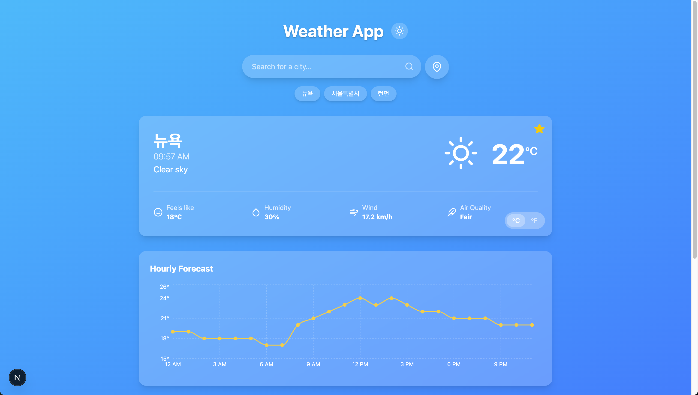

# Weather Forecast App

A sleek and modern weather application built with Next.js and Tailwind CSS. Search for any city worldwide, get real-time weather data, and save your favorite locations for quick access.

## 📸 Screenshot



## 🚀 Live Demo

[https://weather-app-next-gold.vercel.app/](https://weather-app-next-gold.vercel.app/)

-----

## ✨ Features

  * **City Search**: Dynamically search for cities worldwide.
      * **Debounced Input**: API calls are only made after the user stops typing, improving performance.
      * **Dynamic Language**: Automatically detects Korean input to provide search results in Korean.
      * **Keyboard Navigation**: Use `ArrowUp` and `ArrowDown` keys to navigate suggestions and `Enter` to select.
  * **Real-time Weather Data**:
      * Current conditions (temperature, "feels like," humidity, wind speed).
      * Dynamic weather icons and descriptions.
      * Hourly temperature forecast chart.
      * 7-day weekly forecast.
  * **Dynamic UI**: The background gradient smoothly transitions to match the current weather conditions.
  * **Geolocation**: Instantly get the weather for your current location with a single click.
  * **Favorites System**:
      * Add or remove cities from a persistent favorites list.
      * Favorites are saved locally in the browser using `localStorage`.
  * **Session Persistence**: The last searched city is automatically loaded when you revisit the app.
  * **Accessibility**: Press `Enter` from anywhere on the page to immediately focus the search bar.

## 🛠️ Tech Stack

  * **Framework**: [Next.js](https://nextjs.org/) (with App Router)
  * **Language**: [TypeScript](https://www.typescriptlang.org/)
  * **Styling**: [Tailwind CSS](https://tailwindcss.com/)
  * **Icons**: [React Icons](https://react-icons.github.io/react-icons/)
  * **Charting**: A chart library (e.g., [Recharts](https://recharts.org/) or [Chart.js](https://www.chartjs.org/)) for the hourly forecast.
  * **APIs**:
      * [Open-Meteo Geocoding API](https://open-meteo.com/en/docs/geocoding-api) for city search.
      * [Open-Meteo Weather Forecast API](https://open-meteo.com/en/docs) for weather data.

-----

## 📂 Project Structure

```
src/
├── app/
│   ├── favicon.ico                 # Favicon for the application
│   ├── globals.css                 # Global CSS styles
│   ├── layout.tsx                  # Root layout for the application
│   └── page.tsx                    # Main page component
├── components/
│   ├── FavoriteButton.tsx          # Button to add/remove favorite locations
│   ├── FavoritesBar.tsx            # Displays saved favorite locations
│   ├── HourlyChart.tsx             # Chart displaying hourly temperature forecast
│   ├── SearchForm.tsx              # City search input form
│   └── WeatherDisplay.tsx          # Displays current weather conditions
├── hooks/
│   └── useDebounce.ts              # Hook for debouncing input
├── services/
│   └── weatherService.ts           # Handles weather API calls
├── types/
│   └── weather.ts                  # Type definitions for weather data
└── utils/
    └── weatherUtils.ts             # Helper functions for weather data processing
```


## 🚀 Getting Started

Follow these instructions to set up and run the project locally.

### Prerequisites

  * Node.js (v18.x or later)
  * npm, yarn, or pnpm

### Installation

1.  **Clone the repository:**

    ```bash
    git clone https://github.com/your-username/your-repo-name.git
    ```

2.  **Navigate to the project directory:**

    ```bash
    cd your-repo-name
    ```

3.  **Install dependencies:**

    ```bash
    npm install
    # or
    # yarn install
    # or
    # pnpm install
    ```

4.  **Environment Variables**
    This project uses the Open-Meteo API, which does **not** require an API key. Therefore, no `.env.local` file is necessary to run the application.

### Running the Development Server

Start the development server with the following command:

```bash
npm run dev
```

Open [http://localhost:3000](https://www.google.com/search?q=http://localhost:3000) in your browser to see the result.

## 📄 License

This project is licensed under the MIT License. See the `LICENSE` file for more details.

## 🙏 Acknowledgements

A big thank you to [Open-Meteo](https://open-meteo.com/) for providing the free, high-quality weather and geocoding APIs that power this application.